# Happiness Adopter
Our website aims to give a place to the pets whom their owners can't take care of them anymore, so instead of being abandoned the pet can find a new home and a new owner. The Website also provides a page for announcements, so if you have lost your pet you can make an announcement, and anyone who can help well contact you
# Back-end Repository
[Happiness Adopter](https://github.com/NoraGlows/BackEnd-happinessadopter.git)

# Technologies
 - React
 - javascript
 - CSS
 - Bootstrap
 - Axios
 - jsonwebtoken
 - jwt
 - Visual Studio Code
 - GitHub
 - Balsamiq to create our wireframe for the project.

# Team work strategy
- Start with create a wireframe of our application based on user stories.
- Divide the application pages & functionality into different components then start.
- Add styling to our application with css.

 # User Stories :
- As a user, I want to be able to do registration, so that I can have further features related to my account type.

- As a registered user(owner/adopter), I want to have an edit option for my profile info, so that I can update my info when I want.

- As a user, I want to have a more detail option on the pets, so that I can see the details.

- As a pets’s owner, I want to have an add pets option, so that I can add my owned pets to the system.

- As a pets’s owner, I want to have a delete pets option, so that I can delete my owned pets from the system.

- As a pets’s owner, I want to have an edit pets option, so that I can edit my owned pets details in the system.

- As a pets’s adopter, I want an adopt option, so that I can adopt any available pets that I want.

# Wireframe :
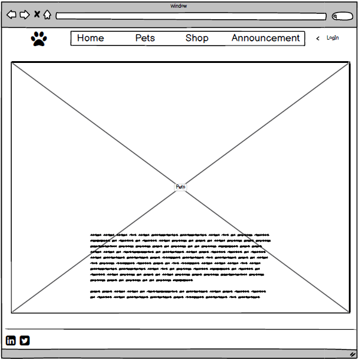
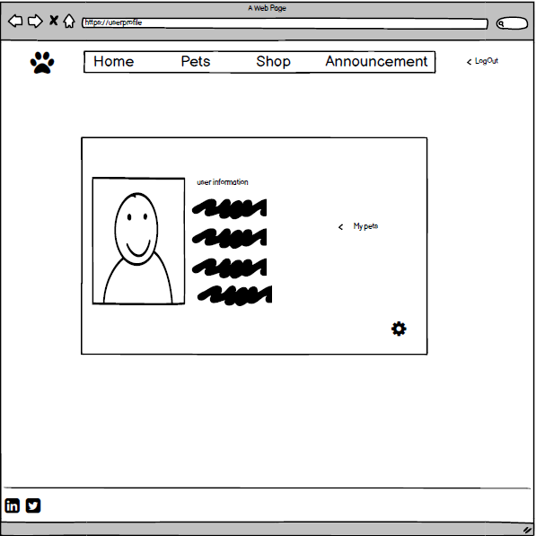
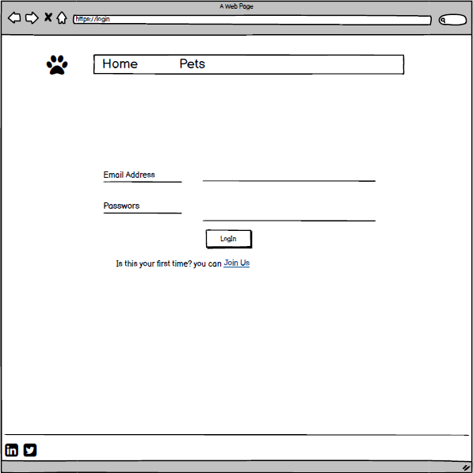
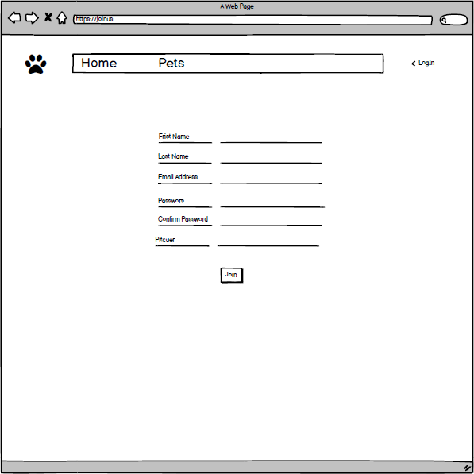
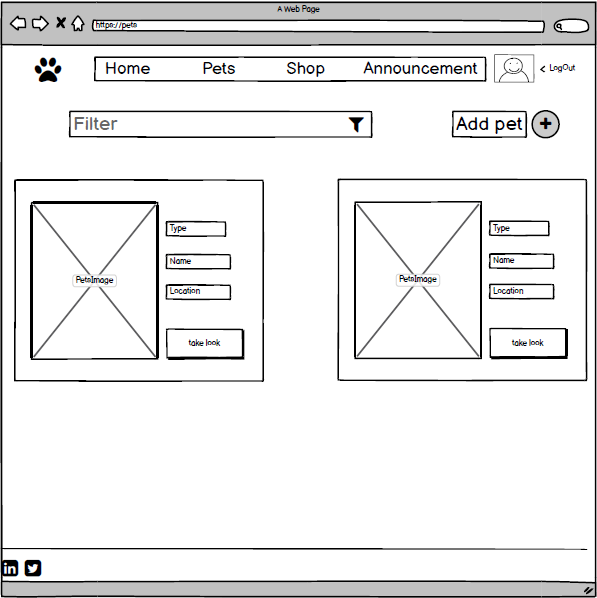
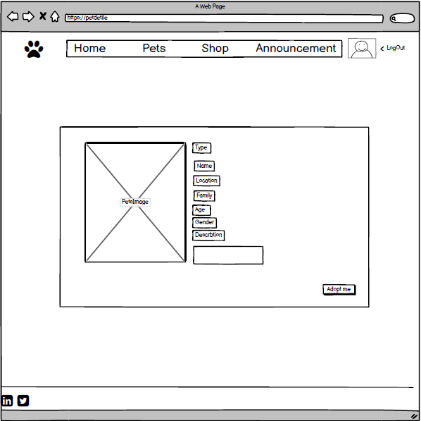
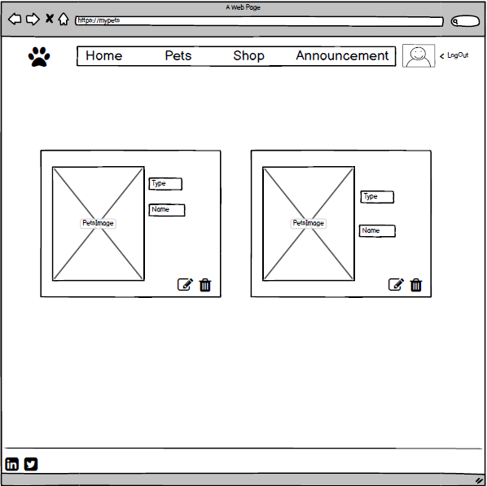
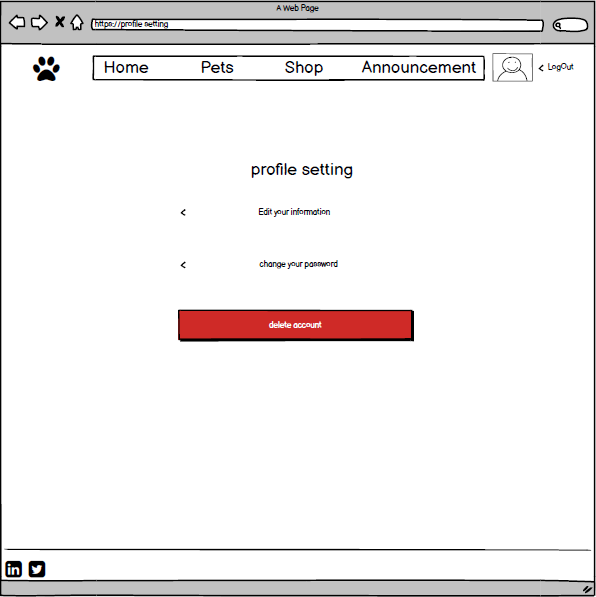

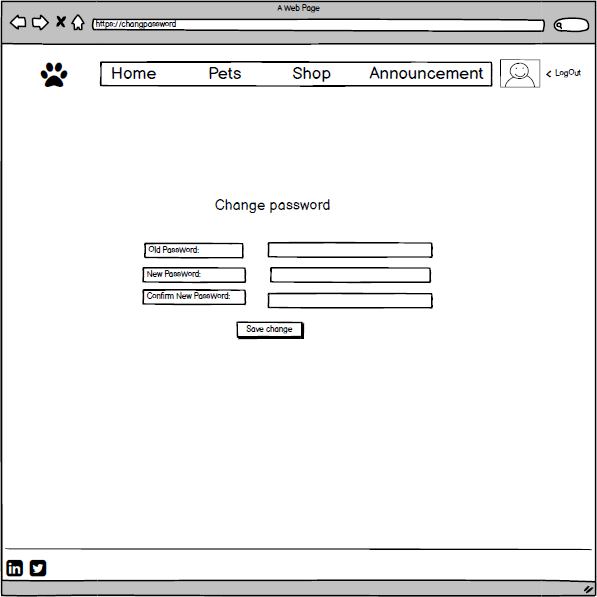
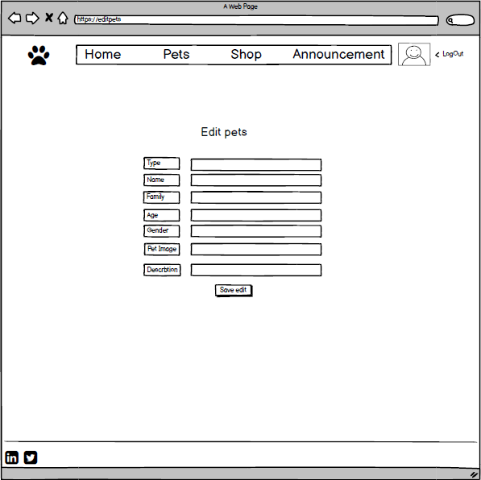
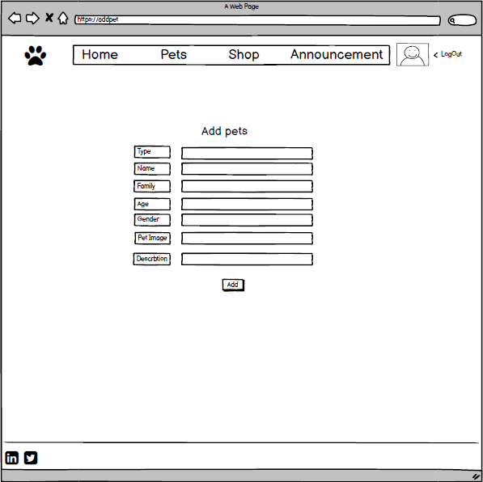
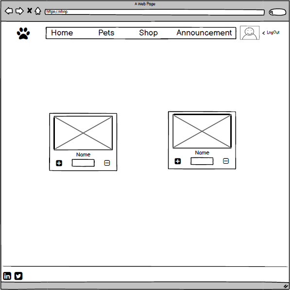
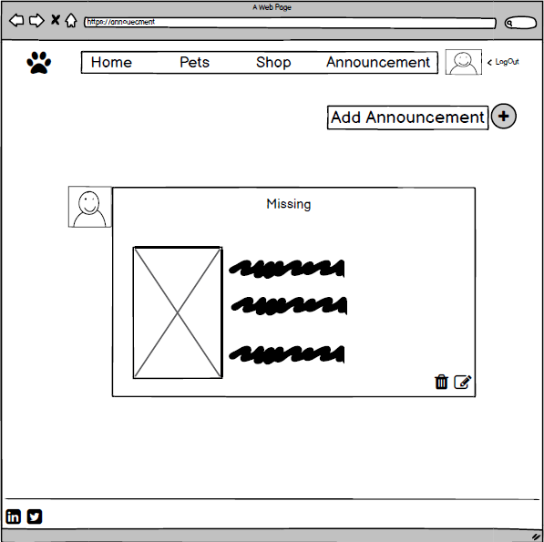
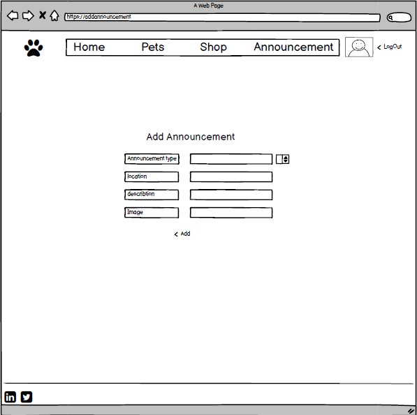

# Future Work
- Add (Shop) to our website for all pets needs.
- Add more styles & design.

# installation & instructions
- npx create-react-app
- npm install - npm start
- npm install axios
- npm install react-bootstrap bootstrap

